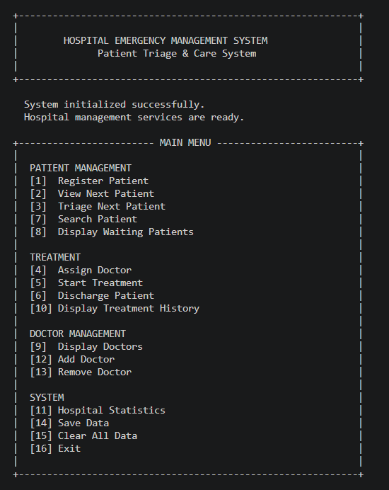
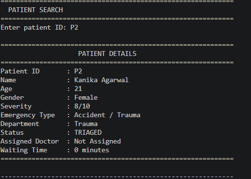
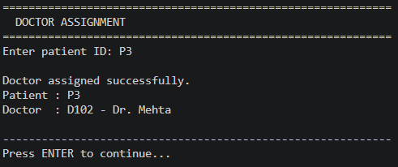
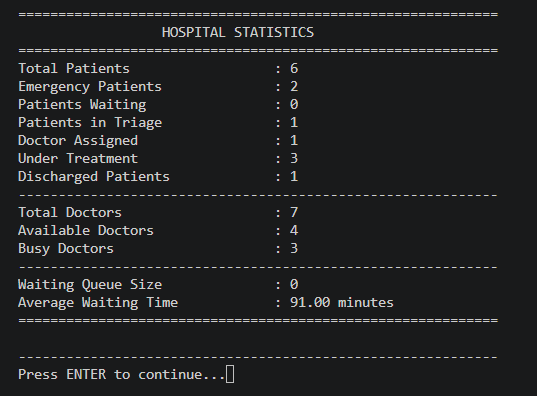

# Hospital Emergency Management & Patient Triage System

> A modular C++ Object-Oriented Hospital Emergency Management System for patient registration, emergency triage, doctor allocation, treatment workflow, persistent data storage, and hospital statistics.

This project demonstrates practical use of **OOP, STL data structures, algorithms, file handling, modular design, and automated testing** in a hospital emergency-management scenario.

---

## Screenshots

### Main Menu


### Patient Details


### Doctor Assignment


### Hospital Statistics


---

## Overview

The system simulates an emergency department workflow from patient registration to discharge.

```text
Patient Registration
        ↓
Emergency Assessment
        ↓
Priority-Based Triage
        ↓
Doctor Allocation
        ↓
Treatment
        ↓
Discharge
        ↓
Treatment History
        ↓
Hospital Statistics

The application follows a modular architecture where different classes handle patient management, triage, doctors, persistence, and statistics.

Key Features
Patient Management
Unique patient ID generation
Patient registration and lookup
Emergency severity classification
Department assignment
Patient lifecycle tracking
Doctor assignment
Treatment tracking
Patient discharge
Emergency Triage

Emergency patients are prioritized using:

priority_queue for emergency cases
queue for normal cases
Severity-based prioritization
Age-based tie-breaking
Arrival-time tie-breaking

Higher-severity patients are processed first. If severity is equal, older patients receive priority, followed by earlier arrival time.

Doctor Management
Add and remove doctors
Doctor lookup
Availability tracking
Department/specialization matching
Patient assignment
Doctor release after discharge
Prevent removal of busy doctors
Patient Lifecycle

Each patient follows a defined workflow:

WAITING
   ↓
TRIAGED
   ↓
DOCTOR_ASSIGNED
   ↓
UNDER_TREATMENT
   ↓
DISCHARGED
Persistent Data Storage

Hospital data is stored locally and restored when the application starts.

data/
├── patients.txt
├── doctors.txt
└── treatment_history.txt

FileManager handles:

Loading patient records
Loading doctor records
Saving patient and doctor data
Saving treatment history
Initializing data files
Clearing stored data
Hospital Statistics

The statistics dashboard provides:

Total patients
Emergency patients
Patients waiting
Patients in treatment
Discharged patients
Total doctors
Available doctors
Busy doctors
Waiting queue size
Average waiting time
Object-Oriented Design

The project follows a class-based modular architecture.

Class	Responsibility
Patient	Patient information and lifecycle state
Doctor	Doctor information and availability
TriageManager	Emergency and normal patient queues
DoctorManager	Doctor management and allocation
FileManager	Persistent data storage
StatisticsManager	Hospital statistics
Hospital	Coordinates the complete workflow
OOP Concepts

Encapsulation
Patient and doctor data is private and accessed through controlled methods.

Abstraction
Hospital operations are divided into specialized manager classes.

Composition
Hospital coordinates the major system components:

Hospital
├── TriageManager
├── DoctorManager
├── FileManager
└── StatisticsManager

State Management
Patients transition through defined lifecycle states from registration to discharge.

Data Structures & Algorithms
Data Structure	Usage
unordered_map	Fast patient and doctor lookup
priority_queue	Emergency patient prioritization
queue	Normal patient FIFO processing
vector	Collection and transfer of records
Custom Comparator	Multi-level emergency prioritization
Complexity
Operation	Complexity
Patient lookup	Average O(1)
Normal queue insertion/removal	O(1)
Emergency queue insertion	O(log n)
Emergency queue retrieval	O(log n)
System Architecture
                 ┌─────────────────┐
                 │    main.cpp     │
                 │   User Interface│
                 └────────┬────────┘
                          ↓
                 ┌─────────────────┐
                 │     Hospital    │
                 │ System Controller│
                 └────────┬────────┘
                          │
        ┌─────────────────┼─────────────────┐
        ↓                 ↓                 ↓
┌───────────────┐ ┌───────────────┐ ┌───────────────┐
│TriageManager  │ │DoctorManager  │ │ FileManager   │
│               │ │               │ │               │
│Queue Handling │ │Doctor         │ │Load / Save    │
│Prioritization │ │Allocation     │ │Persistence    │
└───────────────┘ └───────────────┘ └───────────────┘
                          │
                          ↓
                 ┌─────────────────┐
                 │StatisticsManager│
                 │Hospital Metrics │
                 └─────────────────┘
Project Structure
hospitalEmergency/
│
├── include/
│   ├── Patient.h
│   ├── Doctor.h
│   ├── TriageManager.h
│   ├── DoctorManager.h
│   ├── FileManager.h
│   ├── StatisticsManager.h
│   └── Hospital.h
│
├── src/
│   ├── Patient.cpp
│   ├── Doctor.cpp
│   ├── TriageManager.cpp
│   ├── DoctorManager.cpp
│   ├── FileManager.cpp
│   ├── StatisticsManager.cpp
│   ├── Hospital.cpp
│   └── main.cpp
│
├── tests/
│   └── test_main.cpp
│
├── data/
│   ├── patients.txt
│   ├── doctors.txt
│   └── treatment_history.txt
│
├── screenshots/
│   ├── homePage.png
│   ├── patientDetails.png
│   ├── assignDoctor.png
│   └── hospitalStatistics.png
│
├── CMakeLists.txt
├── README.md
├── LICENSE
└── .gitignore
Build & Run
Requirements
C++ compiler
CMake
Ninja or another supported CMake generator
Git
Clone
git clone https://github.com/Kanika-Agarwal2/hospitalEmergency.git
cd hospitalEmergency
Configure
cmake -S . -B build -G Ninja
Build
cmake --build build
Run
.\build\HospitalEmergencyManagement.exe
Testing

The project includes automated tests using CTest.

ctest --test-dir build --output-on-failure

The test suite helps verify core functionality and detect regressions during development.

Validation & Error Handling

The system validates important operations, including:

Duplicate patient IDs
Duplicate doctor IDs
Invalid patient lookups
Assignment of unavailable doctors
Removal of busy doctors
Patient lifecycle operations
Doctor availability after discharge

These checks help maintain consistency between patients, doctors, queues, and stored data.


License

This project is licensed under the MIT License.
See the LICENSE file for the complete license text.

Author

Kanika Agarwal

Computer Science & Engineering Student